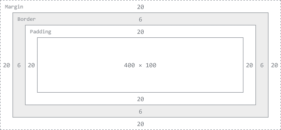

Lesson 3 - Advanced CSS
============================

## Overview
Last week we learned a bit about [Cascading Style Sheets](http://en.wikipedia.org/wiki/CSS) (CSS for short). Today we're going to dig back in and learn some advanced CSS tactics to really make our page look awesome!

## Recap
Last week we learned about a few things...

### Selectors - Classes, IDs, and parent-child relationships
- [We added a ```class``` attribute](https://github.com/CoderDojoSV/beginner-web/tree/master/session2/README.md#classes) to one of our tags so we could apply styles to every element that was labeled with that class. 
- [We added an ```ID``` to an element](https://github.com/CoderDojoSV/beginner-web/tree/master/session2/README.md#ids) to uniquely style an element.

### Declarations
- [We learned about properties and values](https://github.com/CoderDojoSF/webdev-lesson-2-css/blob/master/README.md#properties) and how we can use them to give our elements some style.
- [We learned about states](https://github.com/CoderDojoSF/webdev-lesson-2-css/blob/master/README.md#css-rules-in-the-real-world) so you can make your CSS rules change when certain things happen.

## Box Model

In HTML, every element is a rectangular box. Every box a height and a width that defines how big it is and how much space it will take up on the page. 

If we want to make an image on our page 300px wide and 200px high, we could do the following:

```css
img {
	height: 200px;
	width: 300px;
}
```

However, that isn't the only thing that defines how our image fits on the page because every element is surrounded by three more things: **padding**, **border**, and **margin**. Understanding how your padding, borders, and margins work is essential to making sure that your elements look as expected. 

To help us understand this, we have this diagram:



The "border" is the edge of your box. Padding controls how close things inside the box can be to the border and Margin controls how close things outside the box can be to the border. 

Let's see how this works in practice... First set the body's margin to 0 in the css box:

```css
body {
  margin: 0;  
}
```


If you look at the image on the page, you'll notice how it currently has no margin, padding, or border. As a result, it's pushed up against the left side of the page with no spacing.

Let's first add a border to the image:

```css
img {
  width: 50%;
  border: 2px solid black;
}
```


Let's add some padding to the page to indent the image a little bit.

```css
img {
  width: 50%;
  border: 2px solid black;
  padding-left: 10px;
}
```


Now let's see what happens when we change that padding to a margin.

```css
img {
  width: 50%;
  border: 2px solid black;  
  margin-left: 10px;
}
```


Now you can see that space is added outside the border of the image.

Let's see what this looks like when we add a margin and a border.

```css
img {
  width: 50%;  
  border: 2px solid black;  
  padding-left: 10px;
  margin-left: 10px;
  background-color: tomato;
}
```


You can see, the border color sits between the padding and the margin. If you're ever having trouble positioning your elements, make sure to check all 3: margin, padding, and border. 

## Float

Sometimes you'll want to move things around on the screen. Maybe you want to have the pictures on the right side of the screen and the descriptions on the left. Using ```float``` is a great way to make that happen.

Let's float our pictures to the right and our text to the left. 

```css
img {
  float: right;
  width: 50%;
  margin-left: 10px;
}
```


Whoa! The image mvoed to the right! Before we fix things, let's try to understand why that happened. 

When floating an image, it is going to float all the way to the edge of its parent container. Because I applied float directly to ALL image tags on our page, the float looked to see what the parent container was and saw that it was ```<body>``` so it moved the images to the right edge of the body of the page. 

When floating an image, the other elements will begin to line up around it within the natural flow of the page. 

Let's float the text to the left so that the picture is right next to it. We can do this by wrapping the content into a div and floating to the left:

```html
<div>
    <p id="intro">Today, I'd like to share about my favorite season.</p>
    <p>There are four seasons in a year.</p>
    <ul>
        <li>spring</li>
        <li class="blue">summer</li>
        <li>fall</li>
        <li>winter</li>
    </ul>
    <p>My favorite season is summer, because I can go to the beach with my family.</p>
</div>
```

Here, we want to set the width to less than 50% because our img tag has a width of 50% and also some margin:

```css
div {
  float: left;
  width: 40%;
}
```


Hmm.. but the paragraph with the link is now squeezed in between my content and the image. =(

We can fix this by allowing the paragraph to stretch across the whole page.

To do that, we have to tell the last paragraph tag to clear the float property. Let's add a class to the last paragraph and add a css property:

```html
<p class="clearFloat">Click <a href="http://baytobeachlife.files.wordpress.com/2013/02/male-sealion3-by-chris-parsons.jpg">here</a> to see my favorite sea animal.</p>  
```

```css 
.clearFloat {
    clear: both;
}
```


> **Bonus #1**: What happens if you don't set a height? 

> **Bonus #2**: how would you go about cleaning up this messy code? 

**This can be messy.** There are a lot of weird rules to how floats work and we don't have time to go over all of them but you can [read more here](http://coding.smashingmagazine.com/2009/10/19/the-mystery-of-css-float-property/). 


## Summary

Thanks! Next week we'll start digging into Javascript and some other cool things.

[The Fiddle I used today](http://jsfiddle.net/r7T26/26/).