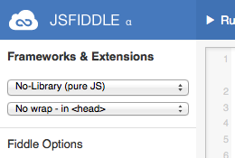

Introduction to JavaScript
=================
### JSFiddle link: http://jsfiddle.net/jeeyun/r7T26/32/

## What is JavaScript?
JavaScript is a programming language that your browser speaks. It is how you can add life into your websites by making the elements you put on the page interact with the user, reading your page. We might use it to pop-up an alert box, do some math, or even change the text on your page without editting your HTML! 

## Using the Inspector and console.log();
Unlike HTML and CSS where you can see what changes you make in your Codepen.IO websites, Javascript requires you to use the web inspector's console to see what is going on. The console is a way to see exactly what your JavaScript code is doing, since sometimes you can't tell if your code works or not just by looking at it like in HTML or CSS. You can access the console in various browsers:

* Chrome: Go to View -> Developer -> JavaScript Console
* Firefox: Go to Tools -> Web Developer -> Web Console
* Safari: Go to Preferences -> Advanced -> select "Show Develop Menu in Menu Bar." After that Develop option should show up on the menu. Then go to Develop -> Show Web Inspector
* IE: Tools -> Developer Tools (click on Scripts tab or Console tab, depending on the IE version)

## Setting up JSFiddle
On the leftside of the page, be sure to select "No wrap - in <head>" for the second dropdown under "Frameworks & Extensions." This will ensure that all of your javascript functions and variables will be available after the page is loaded.



## Using Alert
Let's try writing our very first line of JavaScript. In the JavaScript window of jsfiddle, type in ``alert("CoderDojo is awesome!")``. Click "run" or "update" and see what happens. You should see an alert message that says "CoderDojo is awesome!"

## Using Variables
Variables in JavaScript let you save data with associated names. Let's try writing a couple of variables and use them in our JavaScript. In the JavaScript section of jsfiddle:

* Add a variable with a number ``var number1 = 3``
* Add a second variable with a number ``var number2 = 5``
* Try typing ``alert(number1 + number2)`` and click "Run". 
* Now let's try adding string variables. Strings should start and end with quote marks. You can use either single quote (') or double quote (") but you need to use the same one for both beginning and ending.
* Add a variable called first name ``var firstName = "Jeeyun"``
* Add a second variable called last name ``var lastName = "Lim"``
* Now try typing ``alert(firstName + lastName)`` and click "Run". 
* Hmm the format doesn't look right. Let's try adding a space between them: ``alert(firstName + " " + lastName)``. Much better!

You can name your variable almost anything, but it can't start with a number. Variable names also can't be any of JavaScript's [Reserved Words](http://msdn.microsoft.com/en-us/library/0779sbks.aspx)

## Talking to JavaScript
Let's give your website some personality.
First, we should teach your website your name! In your JavaScript section type in and see what this does:

* ``prompt("What is your name, visitor?")``

You should see an alert box pop up that has a place to type in your name. Go ahead and tell your webpage what your name is! In your Inspector's Console you should see your name in quotation marks.

## What is a function?
A function is a command that will run some code every time you type it in. For example, every time you type in ``prompt("What is your name?")``, a new alert box will pop up on your website. 

Functions are important because usually you want to control when certain code will run on your site. Let's try adding some code that will allow us to click on a link to run our ``prompt()`` function, instead of running our ``prompt()`` function when our page loads.

Functions are just a set of instructions to return the value that you want. It is similar to how baking a cake might have a recipe to follow to always bake the same cake.

* First we need to add a button to our HTML. ``<button onClick="prompt('What is your name?')">Click Me!</button>``

* Now try clicking your button. You can see that using ``onclick="prompt('What is your name?')"`` on the HTML element allowed you to have some control of when the ``prompt()`` is used.


## Writing your own function.
We will write a function to get your name so we can use the value later in our code.

### Your Name
Here we will write a function to return your name.
* We need a button in our HTML to run our code: ``<button onClick="getMyName()">What is your name?</button>``
* And now in our JavaScript:

```
// Log my name
var getMyName = function() {
  var name = prompt("What is your name?");
  console.log("Hello " + name + "!");
  return name;
}
```

## Adding Data to Your Page
All of our JavaScript data is just stored in our JavaScript code right now. But what if we wanted to display our data on the website? Let's create a welcome message for our users.

* First lets add an HTML element for our welcome message. ``<div id="welcome-container"></div>``
* We also need a button to run our function: ``<button onclick="setWelcomeMessage()>Set Welcome Message!</button>"``
* Add some CSS

```
#welcome-container {
  font-size: 25px;
  padding: 20px;
  background: #33ffcc;
  margin: 20px;
  border: 10px dotted white;  
  display: none;
}
```
* Paste this code into your JavaScript section:

```
// Set a welcome message with my data
var setWelcomeMessage = function() {
  var name = getMyName();
  var welcomeMessage = "Welcome " + name + "!";
  var welcomeContainer = document.getElementById('welcome-container');
  welcomeContainer.innerHTML = welcomeMessage;
  welcomeContainer.style.display= 'block';
}
```
Notice how we are using the function we already wrote in our JavaScript to get our ``name`` value.

Keep in mind that browsers are forgetful! They cannot remember everything you do unless we tell our code to make the browser remember. When we refresh our page, the name you stored will be gone.

