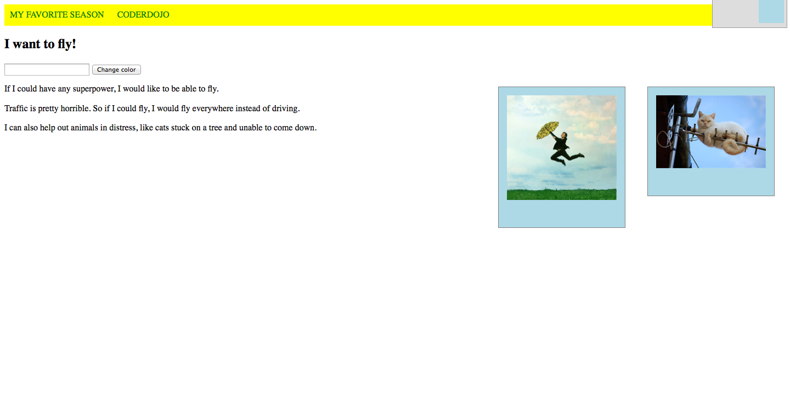
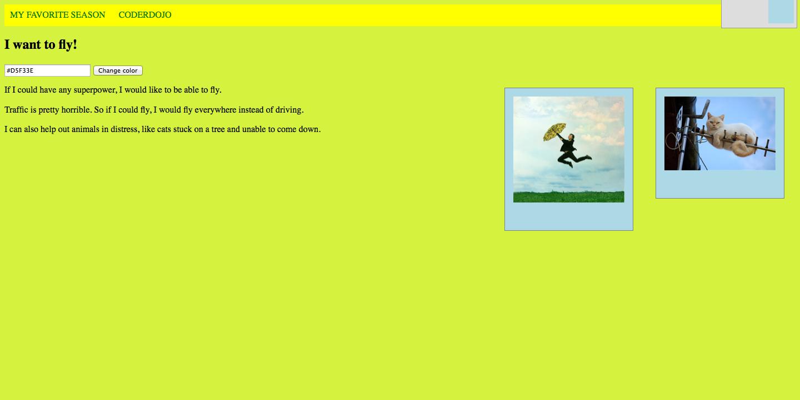
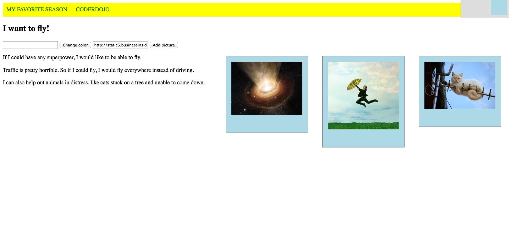
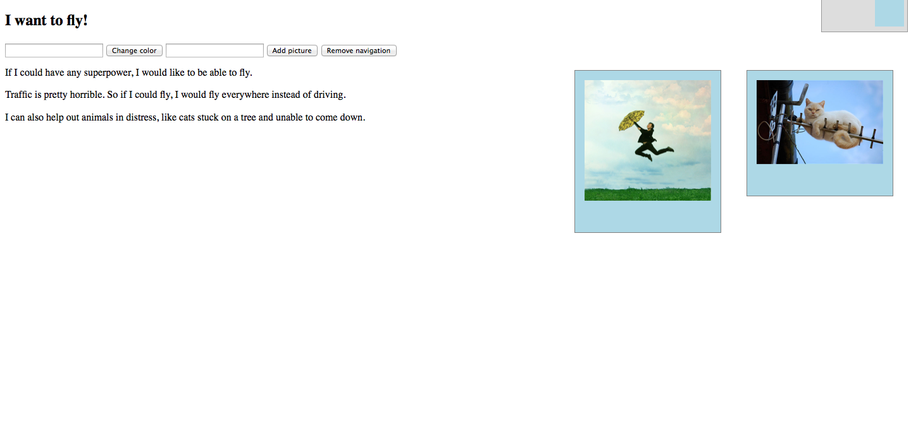

Interactive HTML with JavaScript
=================
### JSBin link: http://jsbin.com/yunam/1/edit

## HTML DOM
HTML DOM (Document Object Model) is the model of your webpage. JavaScript can be used to change and interact with the DOM of your webpage. Click 
[here](http://www.w3schools.com/js/js_htmldom.asp) to read more about DOM.

Today, we will use JavaScript to:

* Change the style (CSS) of HTML elements
* React to HTML DOM events
* Add and delete HTML elements 

## Changing the style
Last week we already tried adding a dynamic message to our website. Let's try to change the background color of our webpage. Within the body of your html (that is between the ``<body>`` and ``</body>`` in your html) let's add an input field and a button:

````
  <input type="text" id="color">
  <button>Change color</button>
````  

Now your webpage should look like this:


In your JavaScript window, write a function that changes the background color of your page:

````
function setColor() {
  var color = document.getElementById("color").value;
  console.log(color);
  document.body.style.backgroundColor = color;
}
````
The ``document`` is the object that contains everything in your page. If you want to access objects in an HTML page, you always start with accessing the document object. The console.log statement isn't necessary but it will help you to see if the variable color has been set with the correct value.

## HTML DOM events
There are many events that can occur on html elements, such as when a user clicks on something or puts the mouse cursor over something. We can use a JavaScript function as an event handler for one of these events. 

Let's add an event handler to the "Change color" button. When a user clicks on that button we want to change the background color of the page. We already wrote the function so let's connect the two.

You can add the function as an attribute to the button itself:

````
<button onclick="setColor()">Change color</button>
````
Or you can add it by writing some more JavaScript (but to do that, let's first add an id to the button so that we can find the button in the document):

````
<button id="changeButton">Change color</button>
````

And the JavaScript to add the onclick event handler:

````
document.getElementById("changeButton").onclick = setColor;
````
Now try running it. You can put a common name into the input field (like ``blue``) or a hex code (like ``#D5F33E``). When you click on the ``Change color`` button you should see the background color change like this:


## Adding and deleting elements
Now we will move on to adding and deleting elements on the webpage. We can ask the user to input a url of a picture they like and add it to the page. Similar to what we have done for setting the color create an input field for the url and a button:

````
  <input type="text" id="pictureUrl">
  <button>Add picture</button>
````  

We will also put our existing images in a div container so that we can easily add another image into it:

````
  <div id="images">
  	
  	
  </div>
````

Let's write a JavaScript function to add an img tag to the webpage:

````
function addPicture() {
  var url = document.getElementById("pictureUrl").value;
  console.log(url);
  var image = document.createElement("img");
  image.src = url;
  document.getElementById("images").appendChild(image);
}
````
The function will read the url from the input, create a new img tag, set the src attribute to the url and add it to the images.


Finally, let's try adding a button that will remove the navigation from your page. We can use a JavaScript function to do that:

````
function removeNav() {
  var myNav = document.getElementById("nav");
  document.body.removeChild(myNav);
}
````

In order to remove an element, you have to always ask the parent element to remove it. So in our case, since the navigation is directly inside the body tag, we'll ask the body to remove it as above.

We can add a button to our page to remove the navigation:

````
  <button onclick="removeNav()">Remove navigation</button>
````  

If everything is hooked up correctly, you should see the navigation disappear when you click on the ``Remove navigation`` button!


That's it for today! Next week we'll play around with jQuery, a popular JavaScript framework that's used by many websites.