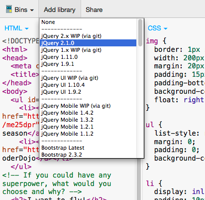

Introduction to jQuery
=================
### JSBin link: http://jsbin.com/lelog/1/edit

## jQuery
jQuery is a JavaScript library that makes it easier for you to write simpler, shorter code to make your webpage dynamic. You can learn more about jQuery on their official website: http://jquery.com

Today, we will use jQuery to:

* Change HTML elements using selector
* Add animation to HTML elements

## Adding the jQuery library to JSBin
Before we start anything else, let's include the jQuery library into your webpage. You can do this by clicking on "Add library," and selecting "jQuery 2.1.0" in the left top corner of your JSBin page



## jQuery selector
In last week's lesson we learned to select an element from the html page by using functions like ``document.getElementById``. After selecting the element we could change the element's attributes and style. In jQuery, you can select an element in the following way:

````
$("img")
$(".nav")
$("#first")
````
For a regular html tag, you can just put the name (but don't forget the quotes!). To select elements by class name you can start with a dot(``.``) followed by the class name, or for selecting elements by id, you can start with a pound sign(``#``) followed by the id. Notice that this is the same syntax you use in your css!

After you have used a selector, you can call additional functions to your element.

Try hiding all of your images in your webpage by:

````
$("img").hide();
````

If you run your code the images in your webpage should disappear.

You can make the jQuery code click on a button too. Remember we created a button to hide the navigation last week? Let's add an id to the button first:

````
<button id="removeButton" onclick="removeNav()">Remove navigation</button>
````
Now you can use jQuery selector to click the button programmatically:

````
$("#removeButton").click();
````
The page should now look pretty empty with the navigation and images gone.

## Adding animation to your page
There are many built-in functions you can call to add simple animation to your page. Since we already hid our images let's try to bring them back! Add the following line to the JavaScript section of JSBin:

````
$("img").slideDown();
````  
When you run the code you should see the images slidedown and show up again on the page. You can put in ``"slow"`` or ``"fast"`` as an optional parameter into the function. Alternatively you can put in a number (in millisecond) for the duration of the animation. Play with different options:

````
$("img").slideDown("slow");
$("img").slideDown("fast");
$("img").slideDown(5000);
````
There are ways to make the elements disappear from the screen instead of appear. For this, we will use fadeOut function to make the navigation disappear. You already wrote a function to make the navigation disappear when you click a button. We can reuse this function by replacing the existing code with jQuery code. Let's first delete this line of code so that the button isn't automatically clicked when you load the page: ``$("#removeButton").click();``

````
function removeNav() {
  $("#nav").fadeOut();
}
````
The fadeOut function can also take in the same optional parameter as slideDown. Try different parameters to see which one you like the best:

````
$("#nav").fadeOut("slow");
$("#nav").fadeOut("fast");
$("#nav").fadeOut(5000);
````

Now you have the basic building blocks to make a webpage about anything you want!